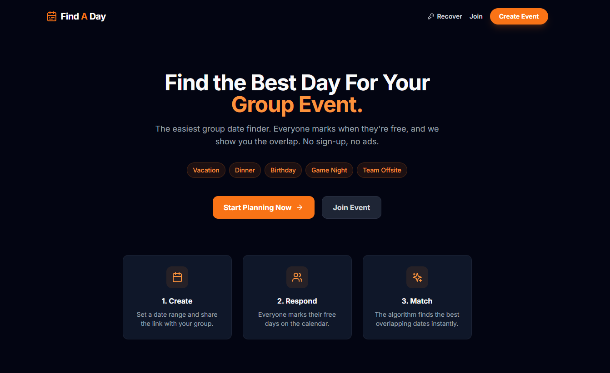
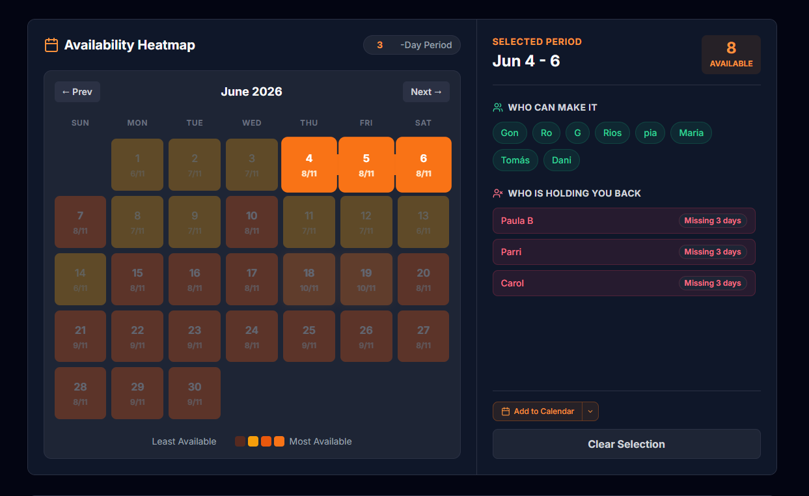

# Find A Day

Find A Day is a web app for scheduling group events, anything from a week-long vacation to a single dinner. Participants mark their availability on a calendar, and an overlap heatmap shows which dates work for the most people. No accounts or sign-ups required; groups are created and shared via links.

Compared to tools like Doodle or When2Meet, it is built around date ranges rather than time slots, which fits multi-day planning better.



## Features

- No accounts. Create a group and share a link; participants join through the link.
- Availability heatmap: a color-coded calendar grid showing how many people are free on each date.
- Voting: the admin proposes candidate dates, participants vote, results update live.
- Location field with Google Places autocomplete.
- Range-based input: participants select date ranges on a calendar instead of picking time slots.
- Admin access via a private admin link, recoverable by passphrase or email.
- Calendar invites: the admin can send the winning date as an ICS file to all participants.



## Tech Stack

- **Frontend**: React 18, Tailwind CSS, Framer Motion, Lucide icons
- **Database**: Firebase Realtime Database (live updates over websockets)
- **Backend**: Vercel serverless functions (`/api` routes) for email and admin operations
- **Email**: Nodemailer over Gmail SMTP
- **SEO**: React Helmet Async for per-route metadata, plus a static prerender step at build time

## Getting Started

### Prerequisites

- Node.js 18 or higher
- A Firebase project with Realtime Database enabled
- A Google Cloud project with the Places API enabled
- A Gmail account with an App Password (only needed for email features)

### Local Installation

1. Clone the repository:
   ```bash
   git clone https://github.com/tomasleote/vacation-scheduler.git
   cd vacation-scheduler
   ```

2. Install dependencies:
   ```bash
   npm install
   ```

3. Create a `.env.local` file in the root directory:
   ```env
   # Firebase
   REACT_APP_FIREBASE_API_KEY="your_api_key"
   REACT_APP_FIREBASE_AUTH_DOMAIN="your_app.firebaseapp.com"
   REACT_APP_FIREBASE_DATABASE_URL="https://your_app-default-rtdb.firebaseio.com"
   REACT_APP_FIREBASE_PROJECT_ID="your_project_id"
   REACT_APP_FIREBASE_STORAGE_BUCKET="your_app.appspot.com"
   REACT_APP_FIREBASE_MESSAGING_SENDER_ID="your_sender_id"
   REACT_APP_FIREBASE_APP_ID="your_app_id"

   # Google Places
   REACT_APP_GOOGLE_PLACES_API_KEY="your_google_maps_key"

   # Email (used by the serverless functions)
   EMAIL_SERVICE="gmail"
   EMAIL_USER="your-email@gmail.com"
   EMAIL_PASSWORD="your-app-password"
   ```

4. Start the development server:
   ```bash
   npm start
   ```
   The app runs at `http://localhost:3000`.

## Deployment

The project deploys to Vercel, which picks up the `/api` serverless functions without extra configuration:

1. Push the code to GitHub.
2. Connect the repository to Vercel.
3. Add the environment variables in the Vercel dashboard.
4. Deploy.

## Testing

Unit and integration tests use Jest and React Testing Library:

```bash
npm test
```

## License

MIT, see the [LICENSE](LICENSE) file.

## Contributing

1. Fork the project
2. Create a feature branch (`git checkout -b feature/my-feature`)
3. Commit your changes
4. Push the branch and open a pull request
